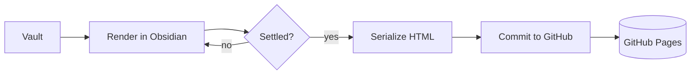
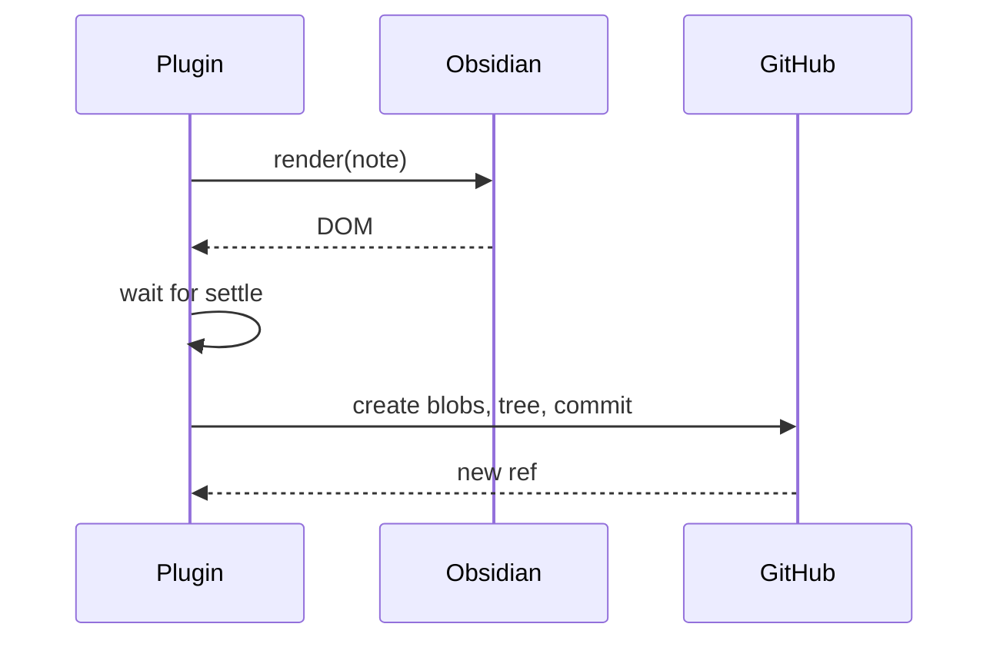
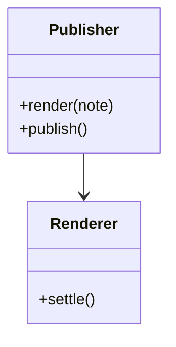

# Mermaid

A flowchart:

```mermaid
flowchart LR
    A[Vault] --> B[Render in Obsidian]
    B --> C{Settled?}
    C -->|yes| D[Serialize HTML]
    C -->|no| B
    D --> E[Commit to GitHub]
    E --> F[(GitHub Pages)]
```

A sequence diagram:

```mermaid
sequenceDiagram
    participant P as Plugin
    participant O as Obsidian
    participant G as GitHub
    P->>O: render(note)
    O-->>P: DOM
    P->>P: wait for settle
    P->>G: create blobs, tree, commit
    G-->>P: new ref
```

A class diagram, to test a layout engine that measures text:

```mermaid
classDiagram
    class Publisher {
        +render(note)
        +publish()
    }
    class Renderer {
        +settle()
    }
    Publisher --> Renderer
```

A deliberately broken diagram:

```mermaid
flowchart LR
    A --> ((( broken
```
